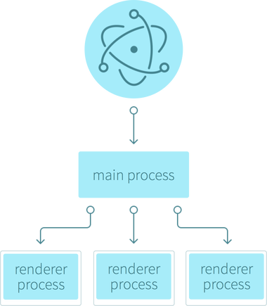

# Electron principles / concepts

Basically electron is divided in two parts : The renderer process and the main process.

When we launch an electron app, a main process will spawn, this process is able to launch renderer proces

In other words, the main process will be the core of your app, and the renderer your app windows. 

It is possible to do a "dangerous" parallel the web world : Your main process is the "back-end" of your app, and the renderer "the cliend side of the app. With the difference that with electron the "back-end" is found on your machine

## Main process

When we launch your app, a mail process will spawn : Basically the main process is a node.js tread. In this process you will make all the "low-level" operation with the host machine, ex : writing files, acces to native system APIs.

This node.js proccess give you access to :
* all the native node.js modules (like fs or path)
* electron modules (ex : notification, to interact with native OS notification system)
* Other imported modules

In this process you will be able to spawn renderer process.

## Renderer process

The renderer process will be executed in a new window, exactly liky javascript in our web page.

When the main spawn a renderer process, a new window will be launched, this window is simply a sandboxed web-page redendered by the chrome engine. It gives you acces to all the last web "functionalitys" like HTML5, CSS grid or flexbox, es6 javascript (An othet advantage, is not necesary to make polifyl to support all browser. In all the platforms, electron will use the same render engine.)

Note on javascript, the renderer process also exectute the javascript with the node.js engine, so it gives you acces to all the node.js modules directly on the renderer process, but by principle we dont use "low-level" modules in the renderer.

## Interaction principles

An example of interaction between main and renderer process :

* You start the app
* A main process spawn
* Then the main main will spawn a renderer process
* The user make action on the renderer, he want to save a file
* The renderer will send a request to the main to show a native save dialog and save the file
* The main will call the electron module who takes access to the natve dialogs
* The user select a folder in the dialog
* The main will save the file with the 'fs' node module, then send a sucess message to the renderer
* The renderer display to the user the message

## IPC

To interact between main and renderer process, electron provides a cutom protocol : ipc.

Ipc provides a simple way to send events with datas between main and renderer.