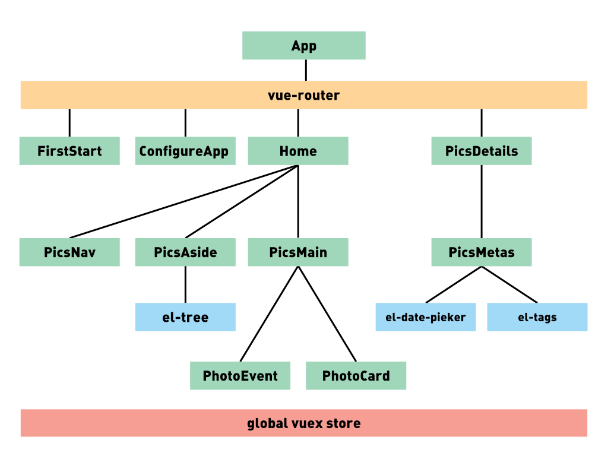

# Renderer process

  

## **Green :** *pics components*

* **App** is the entry component of the app, he includes all the vue.js app and all the components.

---

* **FirstStart** displays the welcome page when we start PICS for the first time

---

* **ConfigureApp** displays buttons to select library folder, and start the importation.  
*This component interact with the main process via ipc. Event sender : **openFolderDialog**, **startImportingPhotos**. Events listener : **dialogFilePath**, **inportingPhotosFinish**.*

---

* **Home** displays the home page of the app
  * **PicsNav** the nav bar, with the search field and all research filters.  
  *This component interact with the main process via ipc. Event sender : **searchPics**.*
  * **PicsAside** displays the tree view and the "update library" button.  
  *This component interact with the main process via ipc. Event sender : **updatePicsLibrary**, **getLibraryTree**. Events listener : **picsLibraryUpdated**, **libraryTree**.*
  * **PicsMain** displays all the pics, separated by event titles.  
  *This component interact with the main process via ipc. Event sender : **getLibraryTree**. Events listener : **libraryTree**.*
    * **PhotoEvent** displays the event title.
    * **PhotoCard** displays the picture and his name with a hover effect.
    
---

* **PicsDetails** displays a big overview of the picture
  * **PicsMetas** displays fields to edit picture metadatas  
  *This component interact with the main process via ipc. Event sender : **editPicsDatas**. Events listener : **picsDetailsUpdated**.*

## **Blue :** *element-ui components*

* **el-tree** element component to display a tree view [component specs](http://element.eleme.io/#/en-US/component/tree).
* **el-date-picker** displays a input field, with a full date-picker on click [component specs](http://element.eleme.io/#/en-US/component/datetime-picker).
* **el-tags** displays a tag list and fields to add tag to the list [component specs](http://element.eleme.io/#/en-US/component/tag).

In the app we use other element-ui components (like : el-button, el-row, el-col, el-input), because their really simple components, and used many times in the app, we decided to not show it in the top diagram. You found all the element-ui ocmponents [here](http://element.eleme.io/#/en-US/component)

## **Orange :** *router*

* **vue-router** this component display the right child component, according to the current route used :
  * **/** => Home
  * **/picsDetails** => PicsDetails
  * **/firstStart** => FirstStart
  * **/configure** => ConfigureApp

## **Red :** *vuex state*

The vuex state defines global datas, accesible by all the components.
* **editedPics property** store the current edited picture data