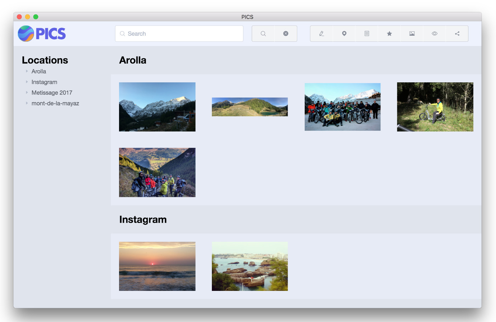

# Features

PICS app includes serveal features such as resarch and editing pics datas.

## Importing pictures

At the first start of the app you will requested to select a folder source. This folder will contains all your pictures, respecting the structure explain in the [requirements](requirements.html) page of this quide.

When you start the importation of the folder, PICS will start the importation of our folder.
When the import is complete, you will be automatically redirected to the main page of the application.

## The main page

  

