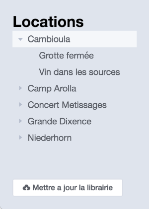
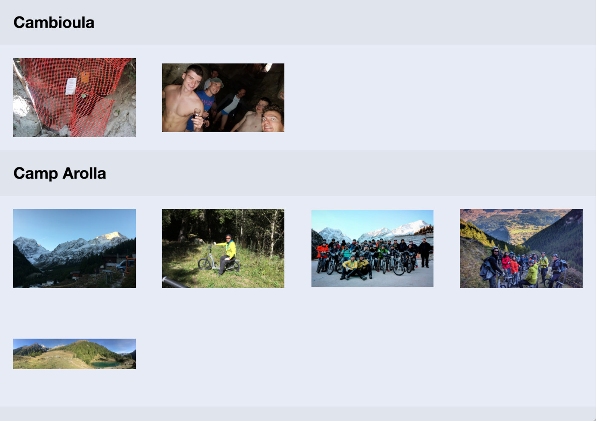

# Features

PICS app includes serveal features such as resarch and editing pics datas.

## Importing pictures

At the first start of the app you will requested to select a folder source. This folder will contains all your pictures, respecting the structure explain in the [requirements](requirements.html) page of this quide.

When you start the importation of the folder, PICS will start the importation of our folder.
When the import is complete, you will be automatically redirected to the main page of the application.

## The main page

  

When we open the app, you will see the main page :

The main page displays all the pics and a tree wiew of your events. In the navigation bar you see a search field and diffrends filters.

### Research bar

  

* **research field** it allows you to search words in all the library. By default he search in all the propertys of a pics.
* **search button** click to launch the research, you can also type enter key.
* **cross button** redisplay the base view
* **name filter** the search will be limited to pics names
* **location filter** the search will be limited to location of the pics
* **description filter** the search will be limited to description of the pics
* **star filter** the search will be limited to the pics you starred
* **panoramic filter** the search will be limited to the panoramic pics
* **people filter** the search will be limited to the peoples asociated to a pics
* **tag filter** the search will be limited to the tags asociated to a pics

You can combine filters to refine your search results.

Example :
* If you type "Marc" with the star filter. "Marc" will be searched only in starred pictures.
* If you type "Marc" with the star and the people filters. "Marc" will be searched only in the person attribute of the starred pictures.

If the search query returns **no results** the main view will be empty.

### The tree view

The tree view provided a simple way to view all events as a list.
* You can click on a parent (represent an event), and the man view will scroll to this event.
* You can click on a children (represent a picture), end the details view of this picture will be open.
* At the bottom of this section you can find an update button, this buttons trigger an update of the library (Pics will watch all the new pictures in the library folder, and add it in the app).

### The main view

The main view display all the pictures, separate by the event title.

When you hover the picture, his name will be displayed. You can click on the pictures to display the details view.

When you type a research, the results will be diplayed on this view.

## Details page

The details view provide a big preview of a picture and inputs to edit pictures datas.

Edition function :
* **Name** change the name of the picture.
* **Date** Change the shoot date of the picture.
* **Place** Change the place where thw picture have been taken.
* **Description** A little description of your picture.
* **Star button** Star and unstar a picture (favorites)
* **Peoples** Add peoples present on the picture
* **Tags** Add tags to our picture
